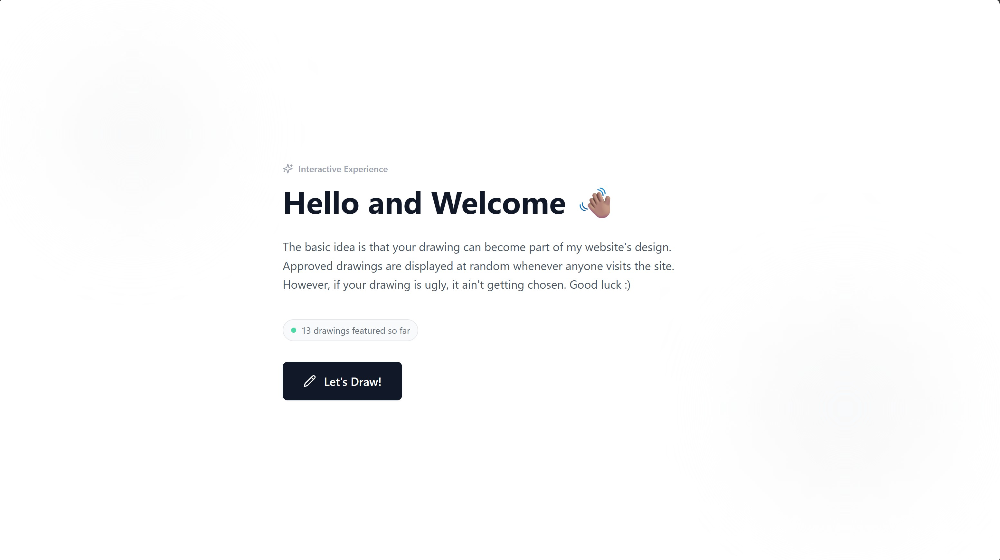

## Problem Statement

Personal portfolio sites are passive. Visitors scroll, maybe read a project description, and leave. There's no reason to interact, no way to leave a mark, and no mechanism for the portfolio owner to understand who's visiting or how they're engaging. Standard analytics tools like Google Analytics provide page views and bounce rates, but nothing specific to what actually matters for a portfolio.

This project adds an interactive drawing canvas to a personal portfolio where visitors can draw, save, and submit artwork. Approved submissions become part of the portfolio itself, turning a static site into something that accumulates community contributions over time. A custom analytics system replaces Google Analytics with metrics that actually matter: full conversion funnels from portfolio visit to drawing submission, tool usage patterns, and drop-off analysis at every stage.

## Goals

| Goal | Success Metric |
| --- | --- |
| Visitors engage with the portfolio beyond passive scrolling | Click-through rate from home page to drawing app |
| Users who start drawing complete and submit artwork | Drawing completion rate (started drawing vs. submitted), modal abandonment rate |
| The drawing tool is intuitive enough that users don't need instructions | Undo/redo frequency (high usage suggests experimentation, not confusion), average time on draw page |
| Full visibility into user behavior across the entire funnel | Complete conversion funnel: Home > Draw Click > Info > Draw > Submit, with step-by-step conversion rates |

## Target Users

**Portfolio visitors** (recruiters, peers, friends) who land on the site and encounter an unexpected interactive element. The drawing feature works as a conversation starter and a memorable differentiator.

**The portfolio owner (me)** who needs to understand visitor behavior, moderate submissions, and track engagement patterns over time.

## Key Features

### 1. Landing Page

A clean, minimalist introduction explaining the concept. Shows a live counter of approved drawings ("X drawings featured so far") with a pulsing indicator. Background gradient blurs add visual depth without competing for attention. The call-to-action button has a pencil icon that rotates on hover.

*Info page with live counter and call-to-action*

### 2. Full-Viewport Drawing Canvas

A React component rendering a full-viewport canvas element that spans edge-to-edge with no overflow under the toolbar. Dynamic resizing logic preserves existing strokes when the window resizes. Minimum window size enforced at 800x600px with a user-friendly message. Mobile visitors get a prompt to switch to desktop.

*Responsive, edge-to-edge drawing canvas*

*Automatic detection of smaller canvases (half-screen on desktop specifically)*

### 3. Vertical Toolbar

Right-aligned, sticky vertical toolbar with Lucide React icons for brush, eraser, undo, redo, clear, save, and exit. Buttons invert on press, and active tools stay highlighted. Brush size is adjusted via a custom triangle-shaped slider.

Tool details:

- **Brush:** Adjustable size from 1 to 20px.
- **Eraser:** True eraser using canvas `globalCompositeOperation: 'destination-out'`, not a white brush workaround. This was a deliberate UX improvement since the white-brush approach breaks on non-white backgrounds.
- **Undo/Redo:** Each stroke (pointer down to pointer up) is captured as an independent state snapshot. Separate stacks for undo and redo allow full history navigation.
    
    
    
    *Sleek vertical toolbar with tool icons in drawing canvas*
    

### 4. Keyboard Shortcuts

| Shortcut | Action |
| --- | --- |
| P | Switch to Pencil |
| E | Switch to Eraser |
| Ctrl+Z | Undo |
| Ctrl+Y / Ctrl+Shift+Z | Redo |
| [ / ] | Decrease / Increase brush size |
| Ctrl+S | Open save modal |
| Delete / Backspace | Clear canvas |
| Escape | Close modals |

### 5. Submission Flow

On save, the canvas is captured as a PNG and a modal opens for name entry and terms agreement. The image uploads to a Supabase storage bucket with RLS-protected insert policy. Metadata (name, image URL, status=pending) is inserted into the drawings table. A confirmation screen with confetti celebrates successful submission. All submission events are tracked for analytics.

*User-facing modal for name entry and terms agreement before upload*

### 6. Admin Moderation Panel

Secure login via Supabase Auth. Card-based grid layout showing pending submissions with click-to-enlarge preview. One-click approve/reject actions with real-time status updates. Stats overview showing pending, approved, and rejected counts.

### 7. Custom Analytics Dashboard

Built from scratch to replace Google Analytics with metrics that are actually relevant to a drawing submission funnel:

| Category | Metrics Tracked |
| --- | --- |
| Traffic and Conversion | Full funnel (Home > Draw Click > Info > Draw > Submit), step-by-step conversion rates, direct vs. referred visitor breakdown |
| Drop-off Analysis | Home page bounce rate, info page drop-off, info page bounce rate, modal abandonment rate |
| Drawing Behavior | Undo/redo frequency, popular brush sizes, brush size change frequency, average time before submitting, canvas clear frequency |
| Visitors | Unique sessions, page views, returning visitor rate (cross-session tracking) |
| Activity Patterns | Hourly heatmap, day-of-week breakdown, monthly trends |
| Submissions | Approval rate, status counts, exit button behavior (confirmed vs. cancelled) |

Time range filtering supports last 7 days, 30 days, 90 days, or all-time views.

*Statistics page including full funnel visualization from home page to submission*

### 8. Cross-Domain Tracking

The portfolio home page (hosted on super.so) and the drawing app (hosted on a subdomain) are connected via a lightweight tracking snippet. Visitor IDs persist across domains, enabling accurate funnel tracking from portfolio visit all the way through drawing submission.

## Technical Architecture

| Layer | Technology |
| --- | --- |
| Frontend | React, TailwindCSS, Lucide React icons, canvas-confetti |
| Backend/Storage | Supabase (PostgreSQL + storage bucket) |
| Analytics | Custom-built tracking system |
| Hosting | Subdomain (draw.ykabusalah.me) connected to main portfolio |

## Results and Lessons

Shipped a fully responsive drawing canvas with end-to-end submission flow, Supabase-powered storage and moderation, and a custom analytics system that provides deeper behavioral insight than Google Analytics could for this use case.

Key takeaways:

- **True eraser beats white-brush workaround.** Using canvas compositing (`destination-out`) for the eraser improved UX meaningfully. The white-brush approach fails the moment you change backgrounds or export with transparency.
- **Snapshot-based undo is simpler than you'd expect.** Recording canvas state as image data on each stroke made undo/redo logic straightforward compared to tracking individual path coordinates.
- **Custom analytics paid for itself.** Generic analytics tools don't know what a "drawing session" is or what "modal abandonment" means in this context. Building purpose-specific tracking surfaced insights that wouldn't have been visible otherwise.
- **Cross-domain tracking requires careful ID management.** Persisting visitor IDs across different hosts (super.so to a subdomain) via URL parameters took more work than expected but was essential for accurate funnel data.

## Roadmap

- Mobile drawing support with touch-optimized interface
- Color picker for multi-color drawings
- Additional brush types (spray, calligraphy)
- Public gallery of approved drawings
- Geo-location tracking to see which cities submissions come from
- Social sharing for submitted artwork
