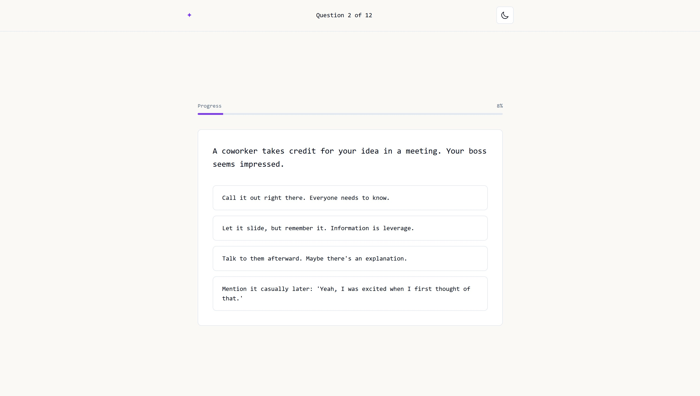
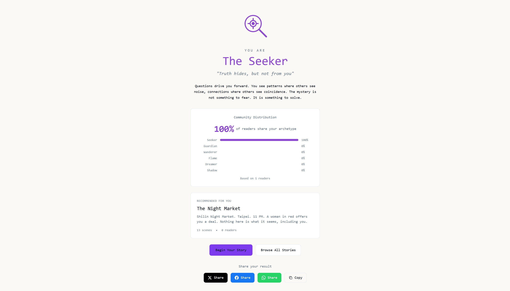
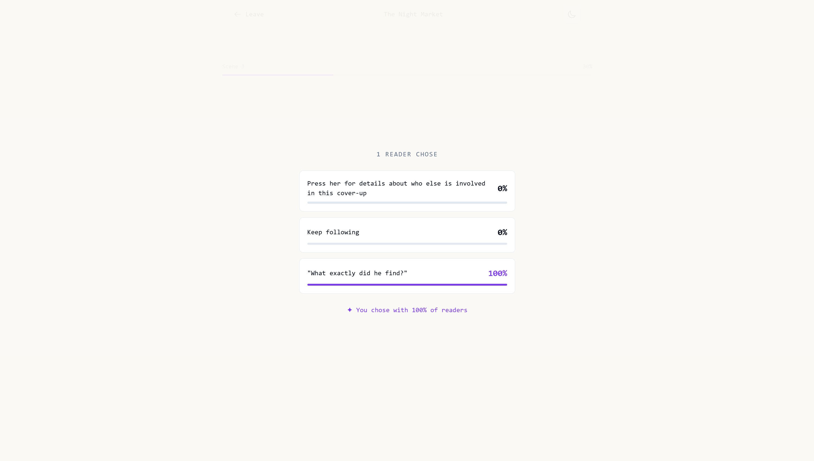
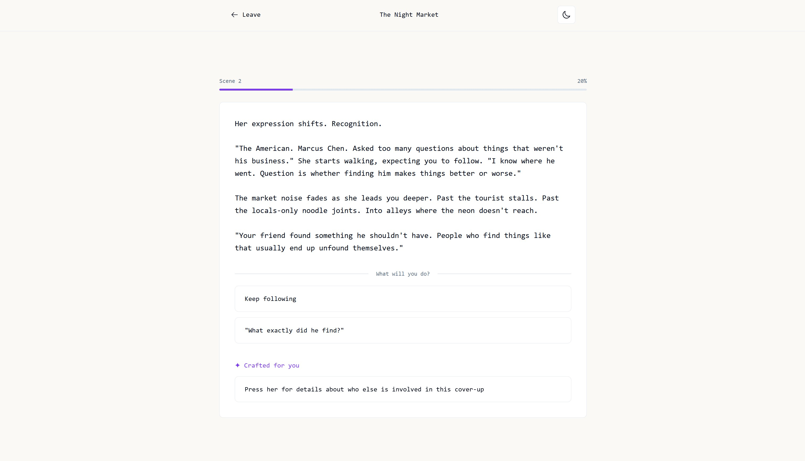
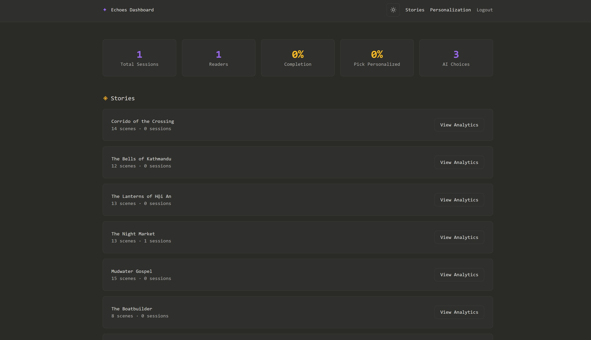
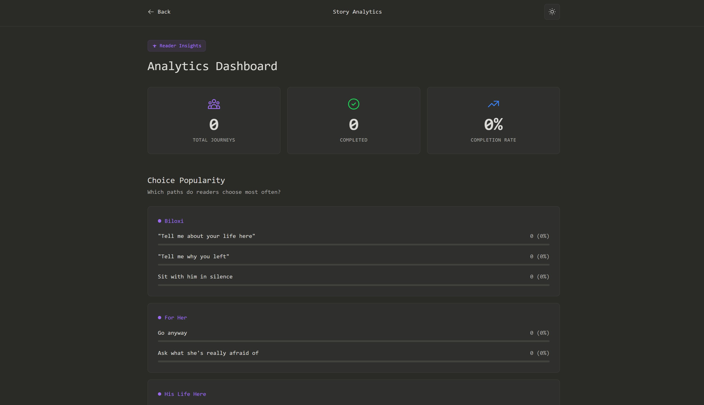
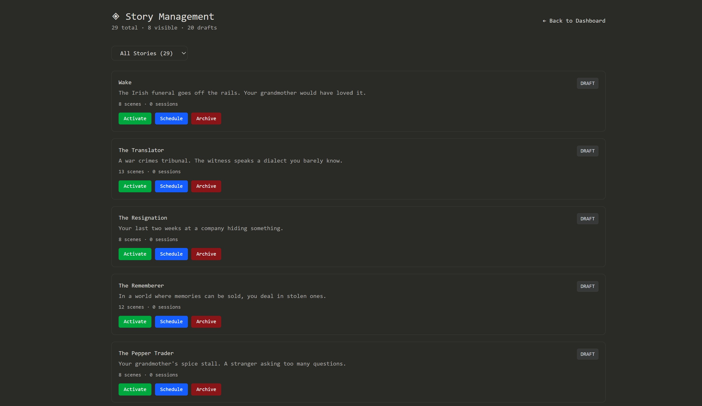

## Problem Statement

Interactive fiction platforms treat every reader the same. Choices are static, branching paths are identical regardless of who's reading, and there's no feedback loop telling authors which story moments actually land. Writers have no data on where readers drop off, which decisions resonate, or how different personality types engage with their narratives.

Echoes addresses this by building a platform where stories adapt to the reader. A personality quiz determines your archetype, and the AI generates choices tailored to who you are. Meanwhile, a full analytics backend gives authors visibility into reader behavior at the scene level.

## Goals

| Goal | Success Metric |
| --- | --- |
| Personalized choices increase engagement over static ones | Personalization pickup rate (% of readers selecting AI-generated "For You" choices) |
| Readers who receive personalized choices finish stories at a higher rate | Completion rate for personalized paths vs. standard paths |
| The quiz accurately surfaces archetypes that feel correct to readers | Archetype accuracy (how often readers pick the choice generated for their specific archetype) |
| Authors can identify weak points in their stories | Scene-level drop-off data available per story in the admin dashboard |

## Target Users

**Readers** looking for interactive fiction that feels personal rather than generic. They enjoy personality quizzes, branching narratives, and seeing how their choices compare to others.

**Authors/Admins** who want insight into how readers engage with their stories, including where attention drops and which choices get picked.

## Key Features

### 1. Archetype Quiz System

A 12-question personality quiz that maps readers to one of seven archetypes (Wanderer, Guardian, Seeker, Flame, Dreamer, Shadow, Jackal). Each question presents a narrative scenario with four choices. Scores are weighted across multiple archetypes per answer because people are contradictory. The assignment is permanent once revealed, which creates commitment and makes long-term tracking possible.

 *Quiz question displaying a scenario with four choice options*

Design decisions worth noting:

- **Morally gray options included.** The quiz has genuinely tempting "bad" choices (keeping a found wallet, ignoring someone in need). This made results feel more honest and less like a Buzzfeed quiz.
- **No back button.** Each choice is final, matching the story experience itself.
- **Animated reveal.** Results unfold with staggered animations, turning the archetype reveal into a moment rather than a data dump.
    
    
    
    *Quiz results page showing archetype reveal with animated stats and social sharing*
    

### 2. Interactive Story Engine

Each story is a set of interconnected scenes forming a branching narrative tree. Each story contains 12 to 30 scenes with multiple paths and endings. The reading interface prioritizes immersion: minimal UI, typewriter text effect (with a skip option), and smooth transitions between scenes.

Every decision is recorded. Readers see what percentage of other readers chose each option ("58% of readers chose this"), which turns reading into something shared rather than solo.

*Choice selection with popularity statistics overlay*

### 3. AI-Powered Personalization

This is the core feature. At designated branch points in each story:

1. The system pulls the reader's archetype from their profile.
2. Claude AI receives the scene context plus the archetype description.
3. A unique choice is generated that appeals specifically to that personality type.
4. The choice is cached in the database so future readers of the same archetype see it instantly.
5. It appears with a "For You" badge distinguishing it from the standard options.

A Guardian might see a choice about protecting someone, while a Flame sees an option for bold action. Both lead to the same narrative destination but feel personally relevant.

*Story choice panel showing personalized "For You" option with badge*

### 4. Analytics Dashboard

A custom-built analytics system (not Google Analytics) that provides metrics specific to interactive fiction:

| Metric Category | What It Tracks |
| --- | --- |
| Overview | Total sessions, unique readers, completion rates, personalization pickup rate, AI-generated choice count |
| Per-Story | Scene-by-scene progression, drop-off points, choice popularity distribution, completion funnel |
| Personalization Effectiveness | Personalized vs. standard choice selection rates, completion by path type, archetype accuracy, engagement time by path |

*Admin dashboard overview with stat cards and metrics*

*Story-specific analytics showing scene progression and drop-off points*

### 5. Story Management

Admin controls for story lifecycle: Draft (hidden, work in progress), Active (visible in library), Featured (spotlight story of the week), and Archived (hidden, preserved). Actions include activate, deactivate, feature, unfeature, archive, and tier assignment.

Actions include: activate, deactivate, feature, unfeature, archive, unarchive, and tier assignment.

*Admin story management panel with status controls*

### 6. Dark/Light Mode and Archetype Theming

Full theme switching with a warm color palette (cream/brown tones, not stark black/white). The site's accent color dynamically changes to match the reader's archetype, carrying the personalization into the visual design itself.

## Technical Architecture

| Layer | Technology |
| --- | --- |
| Frontend | Next.js 16 (App Router), React, TypeScript, TailwindCSS v4 |
| Backend | Next.js API Routes, Prisma ORM |
| Database | PostgreSQL (Neon serverless) |
| AI | Anthropic Claude API for personalized choice generation |
| Hosting | Vercel with auto-deploy from GitHub |

## Results and Lessons

Shipped a complete interactive fiction platform with 8 stories (12 to 30 scenes each), working AI personalization, and a full analytics backend. Deployed to production with automated CI/CD.

Key takeaways from building this:

- **Cache AI-generated content aggressively.** Generating on every request would be too slow and too expensive. Once a choice is generated for an archetype, it's stored and reused.
- **Prompt engineering drives quality.** The quality of personalized choices depends heavily on how archetype traits are described to the AI. Vague descriptions produce generic choices.
- **The quiz needed morally gray options.** The initial version was too "nice." Adding The Jackal archetype (self-interested, pragmatic) made the quiz feel more realistic and the results more honest.
- **Custom analytics beat generic ones.** Building purpose-built tracking gave more relevant metrics than any off-the-shelf solution could. SQL queries with proper null handling prevent dashboard crashes on empty data.

## Roadmap

- Public gallery showcasing community reading patterns and popular story paths
- Story editor so admins can create and edit stories without touching the database
- SEO and Open Graph support for rich social previews when sharing quiz results
- Downloadable archetype cards for social media sharing
- Mobile-optimized touch interactions for story reading
