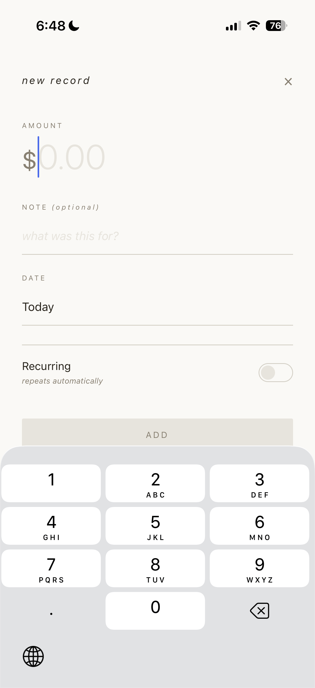
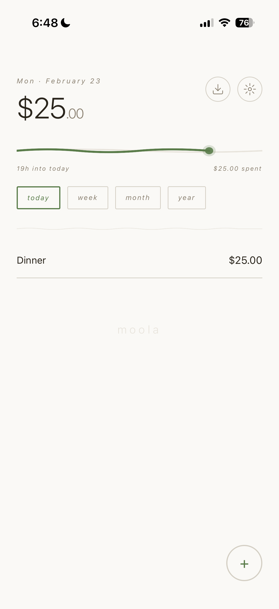
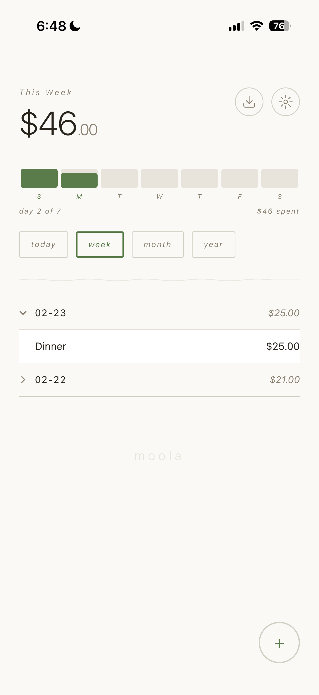
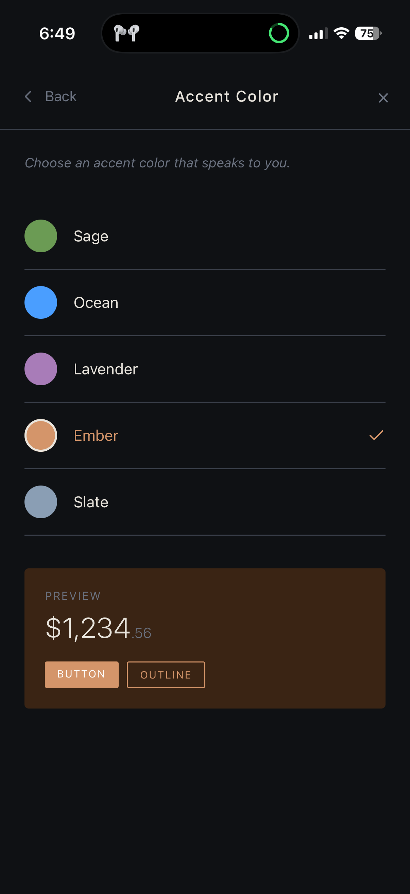
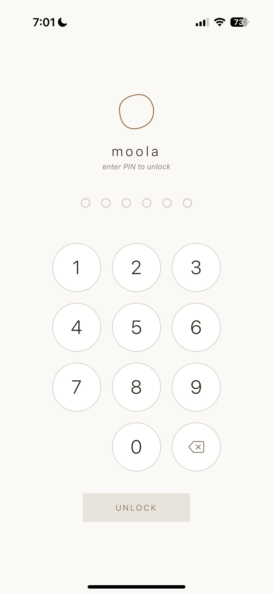
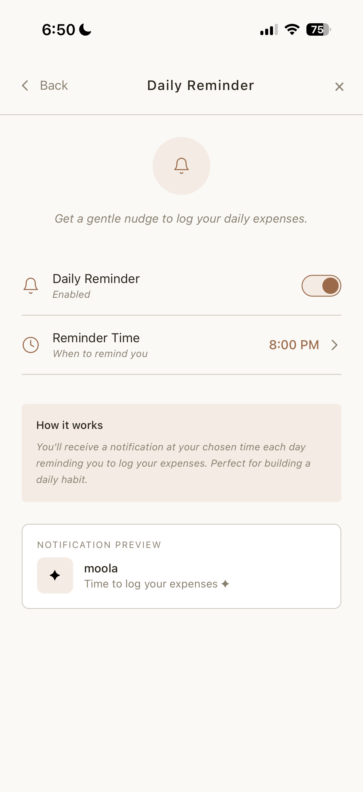
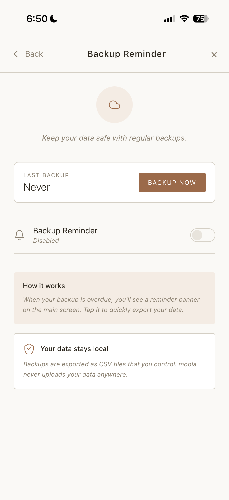
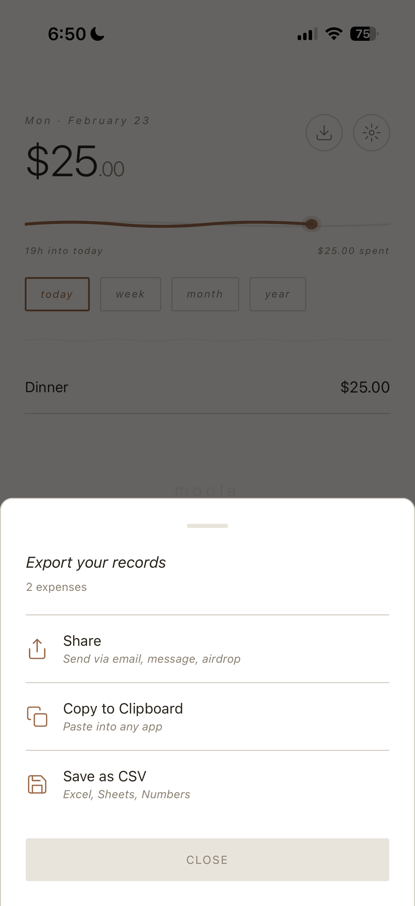
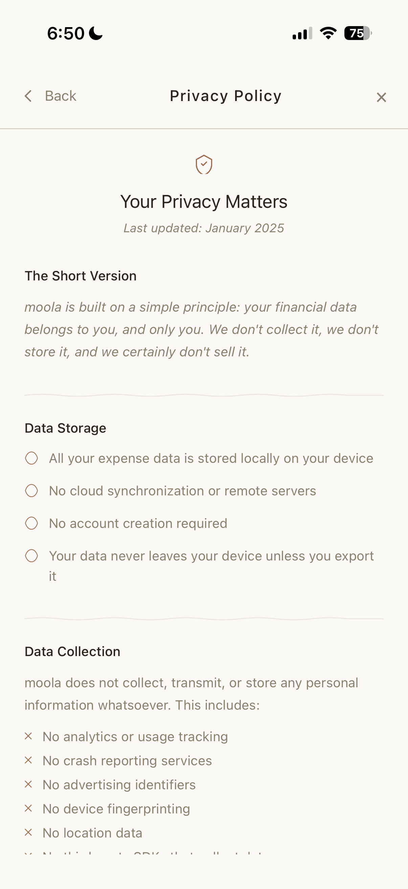

## Problem Statement

Most expense trackers want your data. They require account creation, sync to the cloud, and monetize through ads or premium tiers. For users who just want to log what they spend without handing their financial habits to a company, the options are limited. The alternatives that do exist tend to look and feel like accounting software, not something you'd actually want to open every day.

moola takes the opposite approach: your financial data stays on your device, period. No accounts, no cloud sync, no analytics. The app does one thing well without asking for anything in return. The design draws from Hollow Knight's hand-drawn world to make personal finance feel calm and intentional rather than clinical.

## Goals

| Goal | Success Metric |
| --- | --- |
| Users can log an expense in under 5 seconds | Time from app open to expense saved (tap +, enter amount, done) |
| Financial data never leaves the device | Zero network requests for data storage or transmission; PIN stored in device secure enclave |
| The app feels distinct from typical finance apps | Hand-drawn SVG aesthetic, warm color palette, Hollow Knight-inspired visual language |
| Users build a consistent logging habit | Daily reminder engagement rate, backup reminder compliance |

## Target Users

**Privacy-conscious individuals** who want to track spending without creating accounts or trusting a third party with their financial data.

**Minimalism-oriented users** who are put off by feature-bloated finance apps and just want a simple, pleasant way to log expenses.

## Key Features

### 1. Core Expense Tracking

The flow is dead simple: tap +, enter amount, optionally add a note, done. No categories to configure, no budgets to set up, no friction.



*Add expense modal with amount input and recurring toggle*

Features that enhance without complicating:

- **Recurring expenses.** Mark rent, subscriptions, or bills as weekly/monthly/yearly.
- **Period views.** Switch between today/week/month/year with one tap.
- **Time progress.** Visual indicator showing how far through the current period you are.
- **Date grouping.** Expenses collapse by date for easy scanning.
    
    
    

*Main dashboard showing total amount, time progress visualization, and expense list*



*Week view showing day-by-day progress bars and grouped expenses*

### 2. Visual Design: Hollow Knight-Inspired

The visual language uses wobbly circles instead of perfect ones, organic paths instead of rigid lines, and a muted color palette that feels warm rather than clinical.

Specific decisions:

- **Sketchy SVG aesthetic.** The logo and decorative elements use intentionally imperfect bezier curves.
- **Warm neutrals.** Off-white backgrounds (#faf9f6) and brown text (#2a251c) instead of stark black/white.
- **Italic labels.** Small text uses italics for a softer, more personal feel.
- **Minimal UI chrome.** Focus stays on the numbers and content.

### 3. Customization

moola adapts to user preferences without overwhelming with options:

| Setting | Options |
| --- | --- |
| Theme | Light / Dark mode |
| Accent Color | Sage, Ocean, Lavender, Ember, Slate |
| Currency | 24 currencies with proper symbols |
| Number Format | US (1,234.56) or EU (1.234,56) |
| Decimals | Show or hide cents |



*Accent color picker showing all five options with preview*

### 4. Security

Financial data deserves protection. The app lock uses PIN codes stored in the device's secure enclave (iOS Keychain / Android Keystore).



*PIN entry lock screen with numeric keypad*

- PIN is encrypted on-device, never transmitted.
- Auto-locks when the app goes to background.
- Emergency reset option that clears all data.

### 5. Reminders

Two reminder systems help build habits:

**Daily Reminder:** Toggle on/off with a time picker. Local push notification delivered via expo-notifications.



*Daily reminder settings with time picker*

**Backup Reminder:** Weekly or monthly frequency. Tracks the last export date and shows a banner on the main screen when overdue. One tap to jump to export.



*Main screen with backup overdue banner*

### 6. Data Export

Since there's no cloud, users control their own backups. Three export options: Share (send CSV via email, AirDrop, messages), Copy (paste into spreadsheets or notes), and Save (export to the Files app).



*Export modal with share/copy/save options*

The CSV format is clean and importable:

```
Date,Amount,Currency,Note,Recurring,Frequency
2025-01-25,5.50,USD,"Coffee",No,
2025-01-01,1500.00,USD,"Rent",Yes,monthly
```

### 7. Onboarding

A 4-step flow that establishes the app's personality without asking for anything invasive:

1. **Name.** "What shall we call you?" (personal touch, stored locally)
2. **Greeting.** Animated welcome with the user's name.
3. **Start Date.** When to begin tracking.
4. **Privacy Promise.** "Your coins remain within this vessel."
    
    
    

*Onboarding privacy screen with bullet points*

No account creation, no email collection, no terms to accept.

## Technical Architecture

| Layer | Technology |
| --- | --- |
| Framework | React Native 0.81.5, Expo SDK 54 |
| Language | JavaScript (no TypeScript) |
| Storage | AsyncStorage (data), SecureStore (PIN) |
| Notifications | expo-notifications |
| Auth | expo-local-authentication |
| Architecture | Single-file (~2800 lines), inline styles |
| Target | iOS, Android, Web via Expo |

## Results and Lessons

Shipped a complete expense tracking app ready for App Store submission with full offline functionality, dark mode, 5 accent colors, and 24 currency support. The entire app lives in a single ~2800-line JavaScript file.

Key takeaways:

- **Single-file architecture works at this scale.** Section headers and consistent patterns keep it navigable. The trade-off is no code splitting, which means a larger initial bundle, but for an app this size it doesn't matter.
- **No backend simplified everything.** Privacy-first as a constraint removed entire categories of complexity: no auth flows, no sync conflicts, no server costs, no data breach risk. The downside is no recovery if users delete the app, which is an acceptable trade-off.
- **Warm colors make finance approachable.** Most finance apps use blues and whites. The brown/cream palette and hand-drawn SVGs make moola feel more like a journal than a spreadsheet.
- **DateTimePicker behavior varies between iOS and Android.** Expo's managed workflow handles most platform differences, but date pickers required platform-specific handling.
- **Italic text loses its effect if overused.** It works well for small labels and secondary text but starts to feel like a gimmick if applied too broadly.

## Roadmap

- Biometric unlock (Face ID / Touch ID) with the foundation already in place
- Quick-add presets for common expenses
- Budget goals with progress tracking
- Categories for expense organization
- Home screen widgets
- App Store submission
