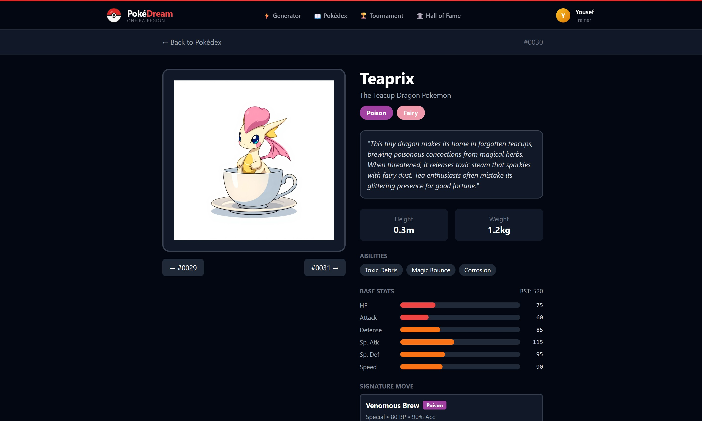
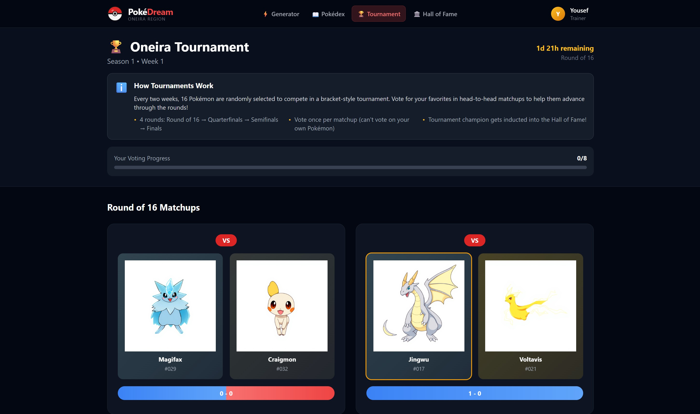
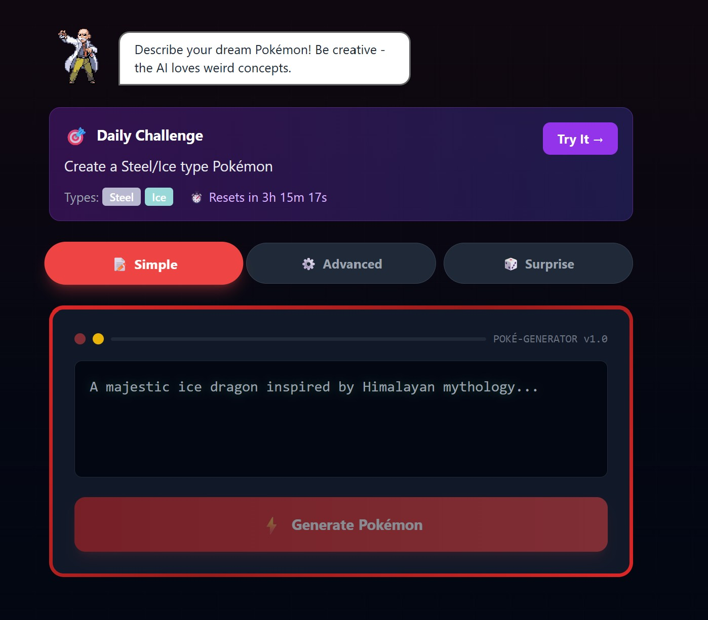
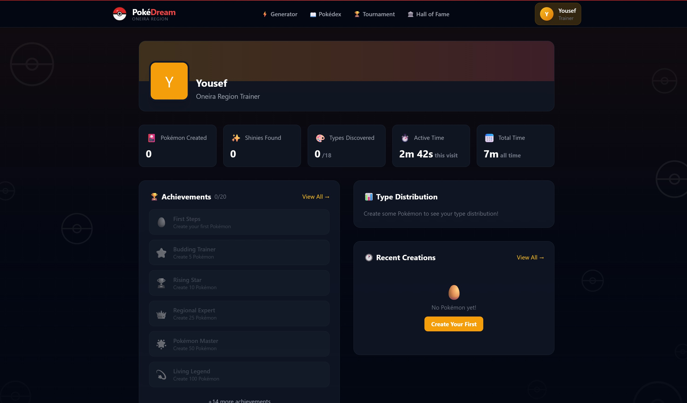
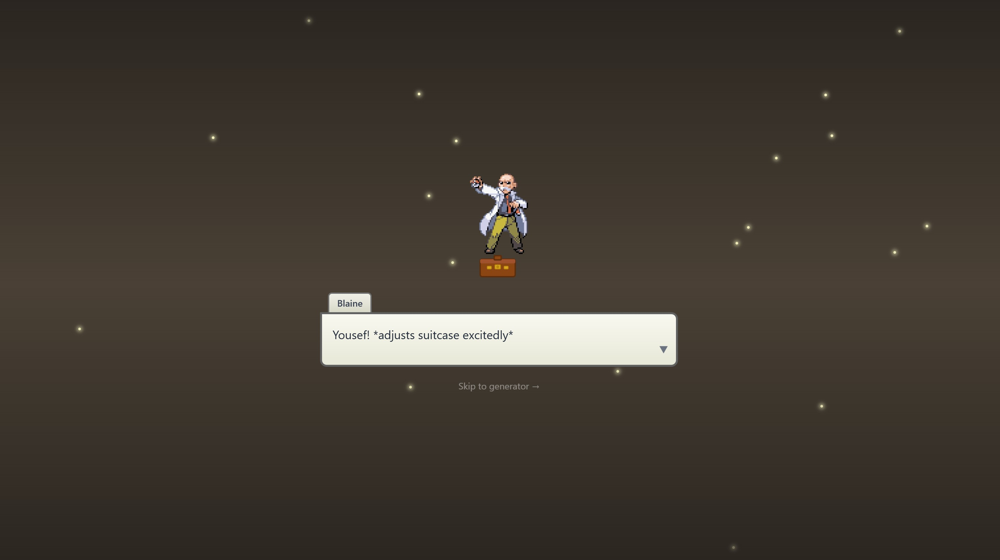
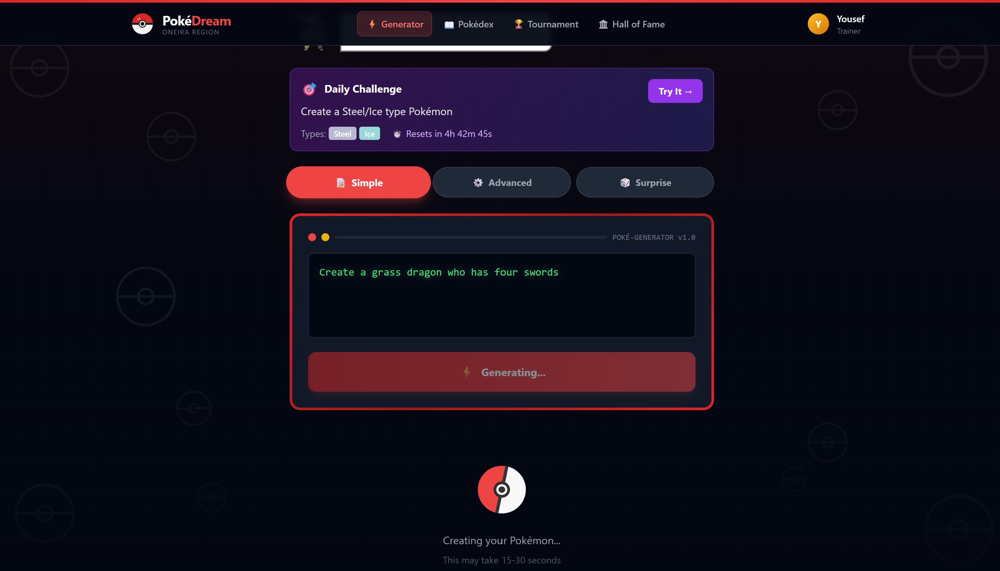
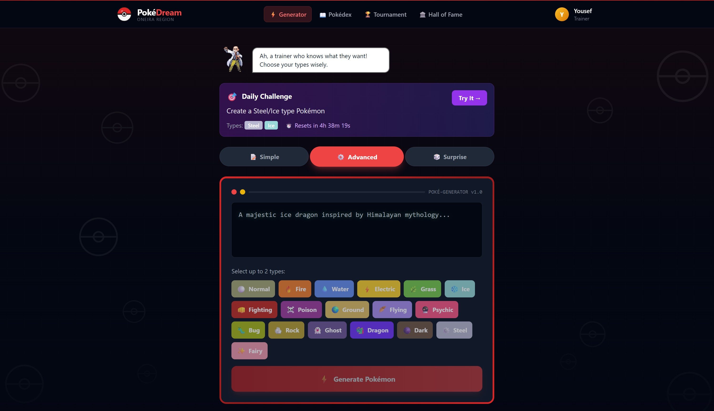

## Problem Statement

Pokémon fan communities have always created custom creatures, but the process is fragmented. You need an artist for visuals, game design knowledge for balanced stats, and deep lore familiarity to make something that feels authentic. Most fan-made Pokémon end up as either cool art with no game mechanics, or spreadsheets of stats with no visual identity. And once they're made, there's nowhere for them to go.

PokéDream turns that into a community. Users describe their dream Pokémon in plain text and receive a fully realized creature: unique artwork, balanced competitive stats, a move-set pulled from an 800+ move database, lore, and a Pokédex entry. Then every creation joins a shared Pokédex, competes in weekly tournaments, and counts toward achievements and daily challenges that give people a reason to come back after their first creation.

## Goals

| Goal | Success Metric |
| --- | --- |
| Users return after their first session | Returning visitor rate, daily challenge completion rate, achievement unlock progression |
| Community features drive engagement beyond solo generation | Tournament participation rate, voting activity per matchup |
| Generated Pokémon feel authentic to the franchise | Stats fall within balanced BST tier ranges; movesets and abilities follow the games' rules |
| The generation pipeline is reliable at scale | Generation success rate (accounting for image API NSFW filter rejections), average generation time |

## Target Users

**Pokémon fans** who enjoy the creative side of the franchise and want to see their ideas brought to life without needing art skills or game design knowledge.

**Casual creators** who want a quick, fun experience. The "Random" generation mode and daily challenges lower the barrier to zero input required.

## Key Features

The AI is how a Pokémon gets made. The community is why anyone makes a second one, so that's where this starts.

### 1. Community Pokédex

Every created Pokémon joins a shared, browsable database. Features include type filtering (18 type buttons), name search, sorting by Pokédex number or date, and pagination for large collections. Each Pokémon has a dedicated detail page with full stats, moves organized by learn method, lore, and creator attribution.

*Pokémon detail page with stats, moves, and lore sections*

### 2. Weekly Tournaments

16-Pokémon bracket competitions auto-generated from recent entries. Users vote head-to-head but cannot vote for their own Pokémon. Winners advance through the bracket and enter a Hall of Fame with categories for Tournament Champion, Fan Favorite (highest vote differential), and Professor's Choice (manually inducted for exceptional creativity).

*Tournament bracket view with voting buttons on active matchups*

### 3. Daily Challenges

Rotating challenges that encourage creative constraints. Types include type combos ("Create a Fire/Ghost type"), cultural prompts ("inspired by Norse mythology"), concept prompts ("based on a musical instrument"), and combined challenges. Same challenge for all users each day via date-seeded rotation. A "Try It" button auto-populates the generator with challenge parameters, and the system auto-detects when a created Pokémon matches the criteria.

*Daily challenge card with countdown timer and "Try It" button*

### 4. Trainer Profiles and Achievements

Each user gets a profile tracking their creative history: total created, shinies found, favorite type, type distribution breakdown, session time, and lifetime time on platform. A 20-badge achievement system unlocks with animated popup notifications across categories: creation milestones (1, 5, 25, 100 Pokémon), shiny hunting, type mastery, and dedication streaks.

*Trainer profile with stats cards and achievement grid*

### 5. Professor Blaine Intro Sequence

The entry point sets the tone. Inspired by Pokémon Platinum's professor intro, users meet Professor Blaine, a reimagined character: ex-Cinnabar Island Gym Leader who fled after "volcanic incidents" and reinvented himself as an AI researcher. New users get a 20-segment dialogue sequence with name input. Returning users get a shorter 7-segment welcome-back flow.

*Intro sequence with Professor Blaine and typewriter dialogue*

Details that matter:

- **Name validation with personality.** Invalid names trigger humorous Blaine responses ("A blank name? What are you, a Ditto?", "One letter? Even Unown uses more than that!").
- **Skip button gating.** Users can skip dialogue, but only after entering their name. This preserves the name-capture flow while respecting impatient users.
- **Visit milestone Easter eggs.** Hidden dialogue triggers at the 5th, 10th, and 25th visit with increasingly self-aware Blaine comments.

### 6. Generation Pipeline

Creating a complete Pokémon requires orchestrating two AI systems in sequence:

1. **Stats and lore generation (Claude).** Receives the concept, types, cultural inspiration, and evolution tier. Returns balanced stats within the tier's BST range, two abilities plus a hidden ability, a Pokédex entry, and extended lore.
2. **Name generation (Claude).** Generates a unique name, cross-referenced against the existing database to prevent duplicates.
3. **Moveset assembly.** Pulls type-appropriate moves from an 800+ move database across level-up, TM, and egg move categories.
4. **Image generation (Replicate, Flux Schnell model).** Structured prompt with retry logic for NSFW filter triggers. Pipeline ordering matters here: generating stats before images lets the image prompt incorporate the Pokémon's name and personality.
5. **Shiny roll.** 1/4,096 chance, matching the authentic mainline Pokémon odds. Modified image prompt adds alternate coloration if triggered.
6. **Database persistence.** Assigns a sequential Pokédex number and stores the complete Pokémon object.

*Generation in progress with step indicators*

### 7. Three Generation Modes

| Mode | Input | Use Case |
| --- | --- | --- |
| Simple | Text description only | Quick, casual creation |
| Advanced | Description + type selection (up to 2) | Targeted creation with type control |
| Random | None | Complete surprise from a pool of 40+ curated concepts combined with random cultural inspirations |

*Generator UI showing mode tabs and type selection grid for advanced creation*

### 8. Visual Design: "Premium Retro"

The visual language balances nostalgia with modern polish. Pixel fonts are used strategically (headers only, not body text). The color system is intentional: Gray-950 backgrounds, Gray-900 cards, Amber-400 accents, with official Pokémon type colors. Card borders draw from the TCG aesthetic.

## Technical Architecture

| Layer | Technology |
| --- | --- |
| Frontend | React 18, Vite, TailwindCSS |
| Backend | Python FastAPI, Pydantic |
| AI (Text) | Anthropic Claude API for stats, lore, and names |
| AI (Image) | Replicate API (Flux Schnell model) |
| Database | JSON file-based (designed for PostgreSQL migration) |
| Hosting | Vercel (frontend) + Render (backend) |

## Results and Lessons

Shipped a creative community where fans make, collect, and compete with their own Pokémon, with tournaments, achievements, and daily challenges that keep people coming back. Under the hood: dual AI orchestration (Claude + Replicate) and authentic game mechanics (shiny odds, stat tiers, type matchups).

Key takeaways:

- **Tournament fairness perception matters.** The "can't vote for your own" rule was a small addition that meaningfully increased how fair the system felt to users.
- **Small timing details drive nostalgia.** The typewriter effect speed, sparkle particle count, and animation delay timings all required tuning. Getting these wrong breaks the illusion.
- **Pipeline ordering matters.** Generating stats before images lets the image prompt incorporate the Pokémon's name and personality traits, producing more coherent results.
- **Retry logic is not optional for image APIs.** Replicate's NSFW filter rejects prompts unpredictably. Without retries, a meaningful percentage of generations would fail silently.

## Roadmap

- Evolution chains: create base forms that can evolve into new generations
- Living homepage map with wandering Pokémon sprites in different biomes
- Day/night cycle affecting which types appear more frequently
- PostgreSQL migration to scale beyond JSON file storage
- Social sharing with branded artwork download templates
- Sound effects for generation, shiny sparkle, and Blaine dialogue
