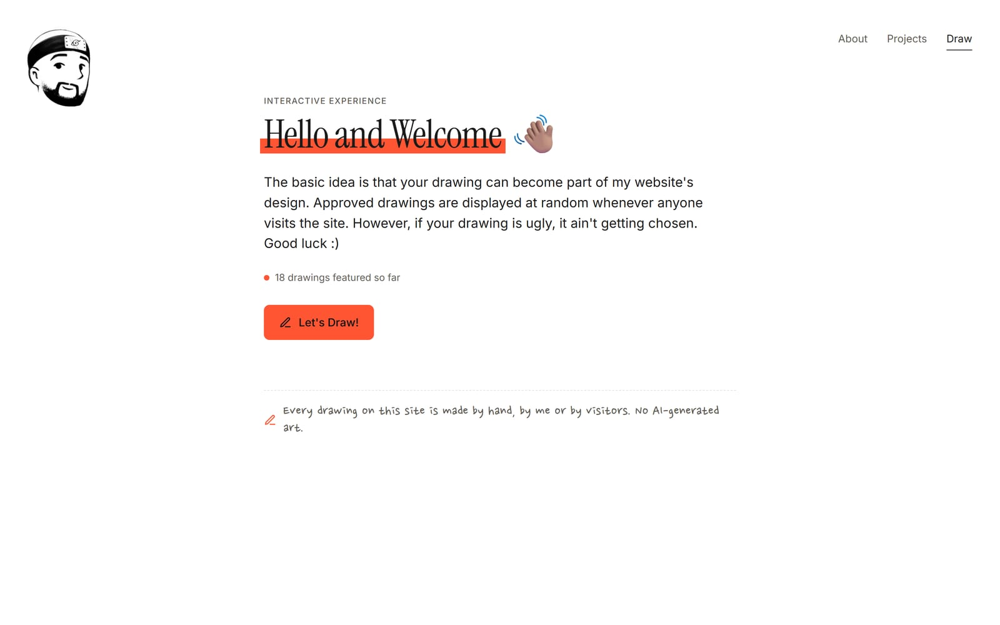
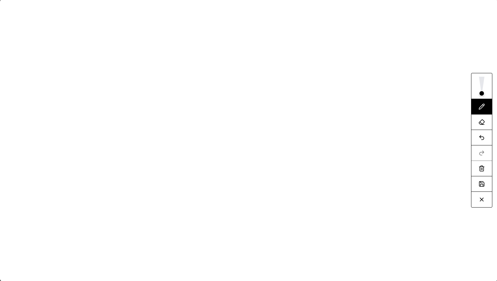
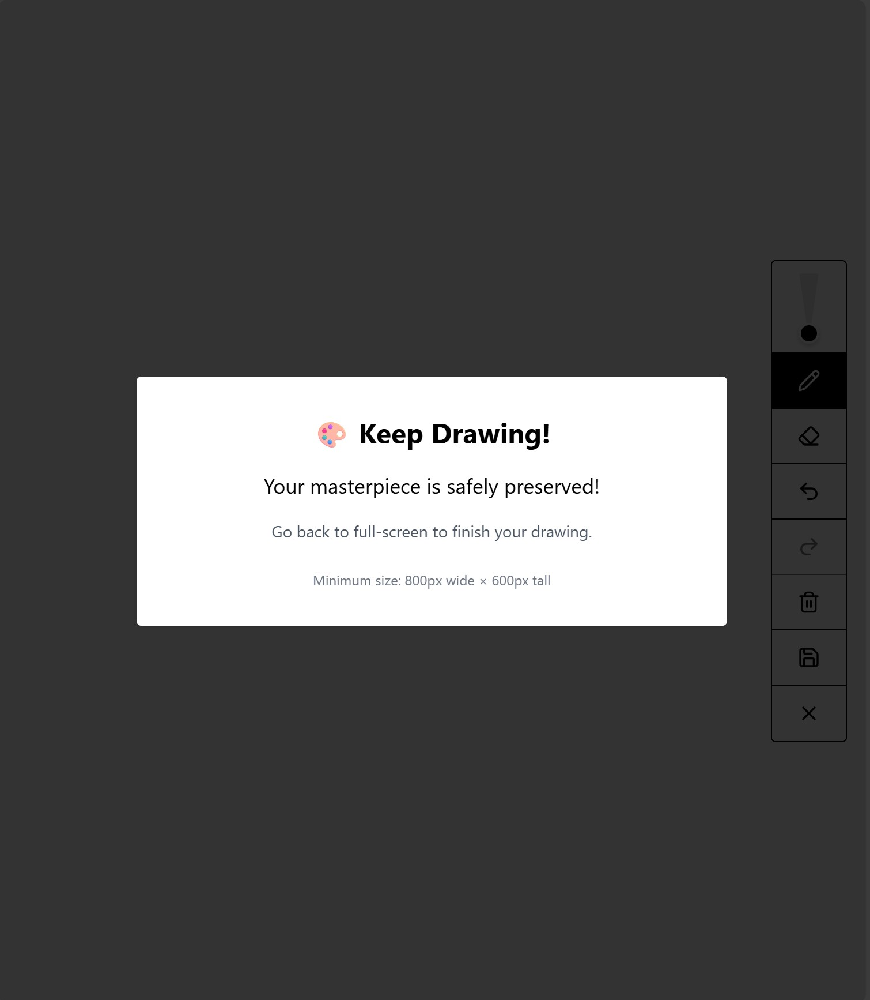
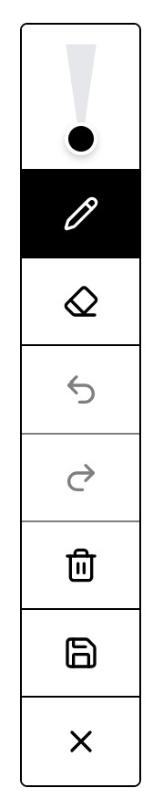
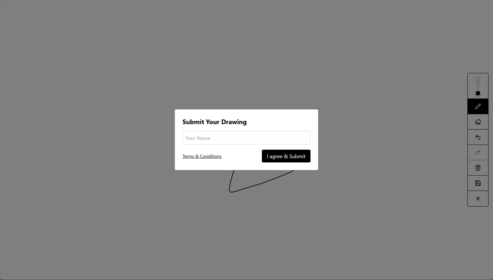
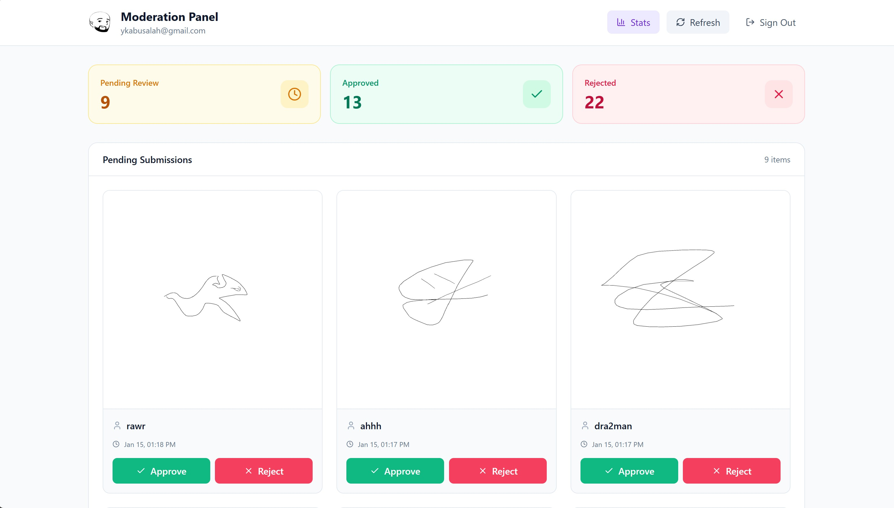
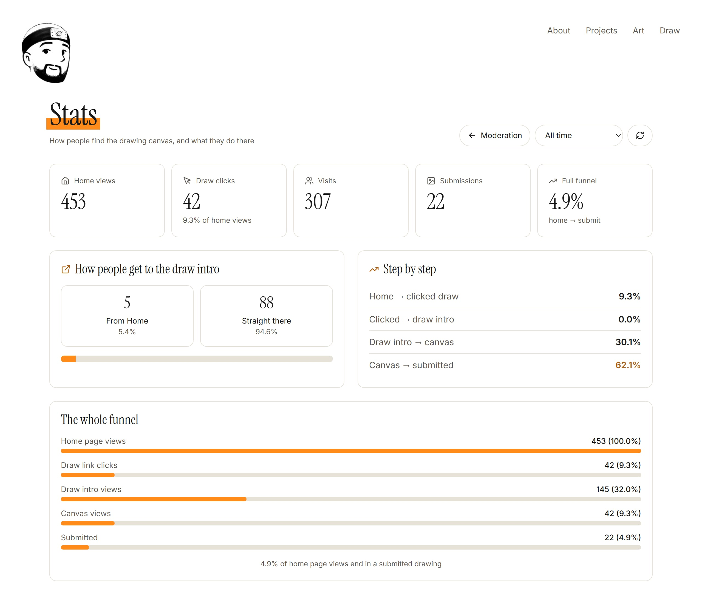

## Problem Statement

Personal portfolio sites are passive. Visitors scroll, maybe read a project description, and leave. There's no reason to interact, no way to leave a mark, and nothing that tells you who actually made the thing.

Mine had a second problem: it didn't look like me. It lived on Super.so, a Notion-based site builder, so it looked like every other Notion site. I draw, and I care about art and storytelling, but you couldn't tell that from the site. The drawing canvas I'd built lived on its own subdomain, stitched to the portfolio by passing visitor IDs through URLs.

So I rebuilt the whole site from scratch around drawing. Visitors draw the home page. Doodles fill the white space and draw themselves in as you scroll. The head in the top corner is a drawing of me that changes with the seasons.

## Goals

| Goal | Success Metric |
| --- | --- |
| Visitors engage with the site beyond passive scrolling | Click-through rate from home page to drawing canvas |
| Users who start drawing complete and submit artwork | Drawing completion rate (started drawing vs. submitted), modal abandonment rate |
| The site feels personal, not like a template | Every page is custom-built, with no templates or stock images |
| My art stays mine | Original files never leave my computer, and the site only serves resized copies |
| Pages load instantly | Pages are plain HTML, with JavaScript only where something moves |
| Full visibility into user behavior across the entire funnel | Complete conversion funnel: Home > Draw Click > Info > Draw > Submit, with step-by-step conversion rates |

## Target Users

**Visitors** (recruiters, peers, friends) who land on the site and find something they didn't expect: a drawing someone like them made, and an invitation to add their own.

**Me**, the owner, who needs to moderate submissions, understand how people use the site, and update it without a website builder.

## Key Features

### 1. The Drawing Is the Home Page

The first version put visitor drawings in a side panel with a museum-style label, and it felt like an exhibit instead of part of the site. So now the drawing is the whole page. Every visit picks a random approved drawing, skipping the last few you've already seen, and draws it in stroke by stroke with a handwritten "drawn by" credit. My intro sits on a color sticker in the corner, with a "Sorry, I'm in the way" button that tips it off the screen when you want to see the full drawing.

Drawings are made on a laptop-sized canvas and shown full screen, which means blowing them up about 3x. Upscaled PNGs looked blurry at that size, so every approved drawing is traced into a vector (SVG) when the site builds. The lines stay sharp at any size.

### 2. Draw Intro Page

A short "Hello and Welcome" page explaining the idea, with a live tally of drawings submitted, how many made the cut, and the approval rate ("yes, I'm picky"). It's plain HTML so it shows up instantly, and it quietly preloads the canvas in the background so "Let's Draw!" opens fast.

*Draw intro page with the live count of featured drawings*

### 3. The Drawing Canvas

A full-viewport canvas that spans edge to edge, keeps your strokes when the window resizes, and tells you when the window's too small to draw in. Phones draw sideways: hold one upright and a little animation asks you to turn it, then the canvas fills the screen in the same wide shape as on a computer, so every drawing fits the Home page. Turn it back mid-drawing and your drawing waits for you.

*Responsive, edge-to-edge drawing canvas*

*Automatic detection of smaller canvases (half-screen on desktop specifically)*

The toolbar sits on the right: brush, eraser, undo, redo, clear, save, and exit, with a triangle-shaped slider for brush size.

- **Brush:** Adjustable size from 1 to 20px.
- **Eraser:** A true eraser using canvas `globalCompositeOperation: 'destination-out'`, not a white brush. The white-brush approach breaks the moment the background isn't white.
- **Undo/Redo:** Each stroke is saved as its own snapshot, with separate stacks for undo and redo.
- **Shortcuts:** P for pencil, E for eraser, Ctrl+Z to undo, Ctrl+Y to redo, [ and ] for brush size, Ctrl+S to save.

*Sleek vertical toolbar with tool icons in drawing canvas*

### 4. Submitting and Moderation

On save, the drawing is captured as a PNG and a modal asks for a name and agreement to the terms. It uploads to Supabase as pending, and a confetti screen says thanks.

Nothing goes on the site until I approve it. The moderation panel shows pending drawings in a grid with one-click approve and reject. Only my account can open it: the database itself checks for a moderator flag on every request, so the panel's password isn't the only thing standing in the way.

*User-facing modal for name entry and terms agreement before upload*

*Admin interface for reviewing and managing submitted artwork*

### 5. Custom Analytics Dashboard

Built from scratch to replace Google Analytics with metrics that are actually relevant to a drawing funnel:

| Category | Metrics Tracked |
| --- | --- |
| Traffic and Conversion | Full funnel (Home > Draw Click > Info > Draw > Submit), step-by-step conversion rates, direct vs. referred visitor breakdown |
| Drop-off Analysis | Home page bounce rate, info page drop-off, info page bounce rate, modal abandonment rate |
| Drawing Behavior | Undo/redo frequency, popular brush sizes, brush size change frequency, typical time from first stroke to submitting, canvas clear frequency, completion rate |
| Visitors | Unique sessions, page views, returning visitor rate (cross-session tracking) |
| Activity Patterns | Hourly heatmap, day-of-week breakdown, monthly trends |
| Submissions | Approval rate, status counts, exit button behavior (confirmed vs. cancelled) |

Time range filtering supports the last 7, 30, 90, or 365 days, or all time. My own visits don't count: signing in to moderation marks my browser, and preview deploys and bots are skipped too. The headline numbers are also public in the "By the numbers" box above, pulled live from a database function that only returns totals, never individual visits.

*Statistics page including full funnel visualization from home page to submission*

### 6. Doodles That Draw Themselves

Every page has doodle spots in its white space: a globe next to my Keegan Fellowship, a Poké Ball for every kind on the pokédream page, a symbol for each of moola's 24 currencies. When one scrolls into view, it draws itself in stroke by stroke, the same way the home page drawing does.

On the long project pages, they're scattered like they were dropped there by hand. Sides mostly take turns but sometimes double up, the gaps are uneven, and each one sits at its own distance from the text, size, and tilt. The layout comes from each spot's name, so it looks random but stays the same every visit.

### 7. A Head for Every Season

The drawing of me in the top corner changes through the year: JoJo in the winter, a red beanie in April, a Mystery of Mew hat in late spring, One Piece's straw hat in July, Naruto at the end of summer, something spooky for Halloween, Ezlo from The Minish Cap in November, and Santa in December. The site's accent color changes with it, picked from each drawing, like One Piece straw yellow or Halloween purple. It's set before the page draws, so the color never flashes.

### 8. A Sketchbook for My Art

My art page is laid out like a sketchbook: every piece is a print taped onto the page with a handwritten caption. Comics read page by page, and hovering the Keegan Fellowship heading explains the four years behind the work.

### 9. Protecting My Art

My drawings never go into git or onto GitHub. They live only on my computer, and the site is deployed from there, not from the repository. The site only ever serves resized copies, at most 1200px wide, and a check after every build removes any original file that slips in. Right-clicking and dragging are turned off on artwork, and every page asks AI scrapers not to train on anything here.

### 10. One Site, One Funnel

The original version lived in two places: the portfolio on Super.so and the drawing app on a subdomain, stitched together by passing visitor IDs through URLs. Moving everything into one Astro site put the entire funnel on one domain, so visitor tracking just works, and there's one less subscription to pay for.

## Technical Architecture

| Layer | Technology |
| --- | --- |
| Site | Astro (static pages), with React only where it's needed: the canvas, moderation panel, and stats dashboard |
| Hosting | Vercel, deployed from my computer as a prebuilt site, so my art never passes through GitHub |
| Backend/Storage | Supabase (PostgreSQL + storage bucket), locked down with row-level security |
| Drawing pipeline | sharp and potrace trace approved drawings into SVGs at build time |
| Doodles | A stroke-by-stroke draw-in animation as each one scrolls into view |
| Seasonal theming | A yearly schedule picks the head and accent color before the page draws |
| Analytics | Custom-built tracking system |

## Results and Lessons

Shipped a personal site built around drawing: visitor drawings as the home page, an end-to-end drawing and moderation flow, a custom analytics system, doodles that draw themselves in, and a head that changes with the seasons.

Key takeaways:

- **Make the users' work the star.** My first redesign put my intro in a card over the drawing, and it hid the drawing. If visitors are the ones making the art, the art gets the whole page and I get the corner.
- **Small details carry the idea.** One template-looking page or stock icon breaks it, so even the favicon and the accent colors come from my drawings.
- **Upscaling isn't free.** A drawing that looks fine at its original size looks blurry at 3x. Tracing to vectors at build time fixed it without making visitors download anything extra.
- **Ad blockers block more than ads.** The "Sorry, I'm in the way" button stopped working for anyone with an ad blocker, because its code shared a file named "analytics." Keeping page features apart from tracking fixed it.
- **Protect the originals, not just the page.** Hiding the right-click menu is easy. The real protection is that full-size files never leave my computer in the first place.
- **Custom analytics paid for itself.** Generic analytics tools don't know what a "drawing session" is or what "modal abandonment" means in this context. Building purpose-specific tracking surfaced insights that wouldn't have been visible otherwise.
- **Fewer moving parts, fewer problems.** Cross-domain tracking between Super.so and a subdomain took more work than expected. Putting everything on one site deleted that problem instead of solving it again.

## Roadmap

- Dark mode, with drawings turning into chalk on a chalkboard
- My own handwriting as the site's handwritten font
- Color picker and more brush types
- Public gallery of approved drawings
- Social sharing for submitted artwork
